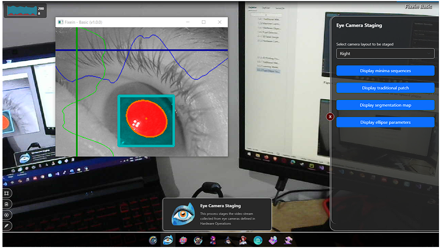
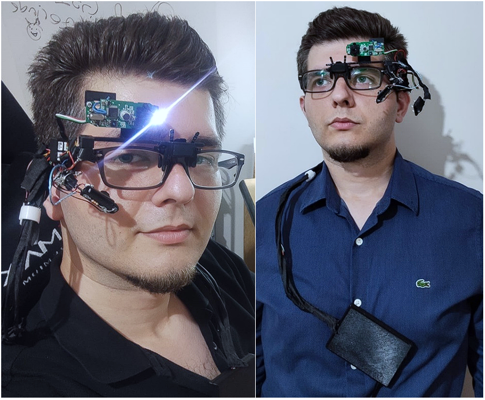

# FIXEIN Eye Tracker

### A Wearable and Modular Eye-Tracking System Based on ROM and PETA

**Real-Time Pupil Detection · Modular Hardware · Plug-In-Oriented Software · 2D Gaze Estimation**

  

> [!IMPORTANT]
> **Repository status — manuscript under review.** The implementation is not public yet. Source code, 3D model files, configuration profiles, and reproducibility scripts will be prepared, documented, and released in this repository after the manuscript is formally accepted.

---

    

## Overview

FIXEIN is a wearable eye-tracking research prototype designed to be adapted to different experimental needs. Unlike systems with fixed hardware and software, FIXEIN allows selected components and settings to be changed without redesigning the entire system.

The platform combines modular, 3D-printed hardware with a configurable desktop application. Its cameras can be replaced using dedicated holders and connectors, and new sensor groups can be added in future versions. The system can be used with its own frame or attached to the user’s personal eyeglasses.

For pupil detection, FIXEIN uses **Retro-Oriented Mind (ROM)** together with **Pupil Ellipse Trend Analysis (PETA)**. ROM performs real-time pupil segmentation and center point detection, while PETA monitors detection quality and can correct inaccurate ellipse parameters.

The current prototype supports the main stages of wearable eye tracking: camera capture, eye-camera setup, pupil detection, automatic ROM configuration, detection-quality monitoring, nine-point calibration, 2D gaze estimation and real-time gaze visualization.

  &nbsp;&nbsp;
  
  &nbsp;&nbsp;

    

## Why FIXEIN?

Wearable eye trackers usually have fixed hardware and software, making them difficult to adapt to experiments with different requirements. DIY systems provide more flexibility, but modifying them may require technical expertise in several areas. FIXEIN is designed as an adaptable research platform. Its hardware components and software settings can be changed according to experimental needs without rebuilding the entire system.

The project focuses on four main goals:

- **Hardware modularity:** replace cameras and attach additional sensor groups through purpose-built holders and connectors.
- **Frame flexibility:** use the dedicated headset frame or adapt the system to the participant's own eyeglasses.
- **Software configurability:** expose detector, correction, calibration, visualization, and publishing components through a plug-in-oriented interface.
- **Real-time accuracy:** aim to provide accurate pupil detection while generating gaze data at frequencies of up to 120 Hz, by using deep learning segmentation methods.

  

### ROM pupil detection

ROM first estimates a variable-size pupil patch using an amplitude-based traditional stage, then passes that patch to a segmentation model. The current FIXEIN evaluation uses **UNet++-S**; the application design also accommodates alternative segmentation models. Restricting inference to the estimated pupil patch reduces computational load and supports stable real-time operation.

### PETA quality control

PETA analyzes the detected pupil ellipse over time. FIXEIN uses its intensity- and entropy-based indicators to expose detection quality and optionally correct implausible ellipse parameters, reducing sudden jumps in pupil measurements.

### Calibration and gaze mapping

The current implementation uses a nine-point, screen-based calibration procedure. At each calibration point, paired pupil and marker observations are collected. Two polynomial functions are then fitted with least squares to map normalized pupil coordinates to normalized world-camera coordinates. The resulting prototype is therefore a **2D, surface-calibrated tracker**; it is not yet a general 3D gaze-estimation system.

    

## Prototype Hardware

| Component | Prototype configuration |
|---|---|
| Eye camera | Taidacent GC0308 CMOS, USB 2.0, up to 128 FPS at 320 × 240 |
| World camera | Logitech C505e, 1280 × 720 at 30 Hz, 60° diagonal FOV |
| Illumination | 940 nm IR LEDs; external four-LED prototype module used in evaluation |
| Connectivity | Codegen CDG-CNV38 USB hub and 4-pin JST connectors |
| Fabrication | SolidWorks-designed parts, 3D printed with PLA+ |
| Operating mode | Monocular eye tracking |
| Face-supported weight | 46.5 g with the headset frame; approximately 62 g when adapted to typical 30 g eyeglasses |
| Complete assembly | 74.5 g excluding cables, including the off-face USB hub assembly |

> Weight figures describe different configurations and should not be compared as if they represented the same assembly. The 32 g wearable module excludes the user's glasses or headset frame; the 74.5 g figure includes the USB hub and holders, whose load is carried by clothing rather than the face.

    

## Evaluation Snapshot

The values below summarize the best calibration–test pair reported for the current research prototype. Measurements were collected with the tracker and calibration surface kept as stationary as possible.

| Metric | Reported result |
|---|---:|
| Maximum gaze-production rate | **120 Hz** |
| Calibration accuracy | **99.55%** |
| Calibration angular error | **0.308°** |
| Calibration surface error | **0.37 cm** at 70 cm |
| Test accuracy | **98.68%** |
| Test angular error | **0.839°** |
| Test surface error | **1.03 cm** at 70 cm |

### Evaluation conditions

- Laptop: AMD Ryzen 7 5800H, NVIDIA RTX 3050 4 GB, 16 GB RAM.
- Calibration display: 15.6-inch, 1920 × 1080, approximately 70 cm from the world camera.
- World camera: 1280 × 720, approximately 53.13° horizontal and 32.72° vertical field of view.
- Eye pipeline: ROM with UNet++-S and PETA, using the externally mounted IR illumination module.
- Reported accuracy is the study's normalized gaze-coordinate score; angular and linear errors are included to make the result easier to interpret physically.

These results characterize the evaluated prototype and setup. They should not be interpreted as a universal guarantee across users, cameras, lighting conditions, mounting geometries, or calibration surfaces.

    

## Current Limitations

- The tracker currently uses **2D surface calibration** and is sensitive to frame slippage, head movement, and operation outside the calibrated surface.
- The desktop software provides the core tracking workflow but does not yet include fixation, blink, or eye-movement event detection and comprehensive post-session analytics.
- The evaluated hardware is a research prototype. Camera ghosting, component size, connector weight, world-camera field of view, and narrow-angle IR illumination remain engineering constraints.
- The effects of infrared emission intensity were not instrumentally characterized; the prototype should not be treated as a certified medical or consumer device.
- Extended comfort and usability were not established through a formal participant study.
- External third-party plug-in loading and 3D gaze estimation remain future work.

    

## Intended Research Use

FIXEIN is intended as a platform for eye-tracking research, rapid prototyping, human–computer interaction experiments, and the development of purpose-specific measurement workflows. Possible future extensions include additional physiological or motion sensors, 3D calibration, richer event detection, and higher-speed configurations for demanding procedures such as video head impulse testing.

    

## Authors

- **Şerif İnanır** — Department of Computer Engineering, Yıldız Technical University; Software Development Department, İstanbul Bilgi University — [sheriffnnr@gmail.com](mailto:sheriffnnr@gmail.com)
- **Ali Can Karaca** — Department of Computer Engineering, Yıldız Technical University — [ackaraca@yildiz.edu.tr](mailto:ackaraca@yildiz.edu.tr)

    

## License and Availability

The manuscript, figures, hardware designs, and unreleased implementation remain **all rights reserved** at this stage. A source-code license and any separate terms for model weights, datasets, documentation, or hardware design files will be declared with the public release. The absence of code in this repository does not grant permission to redistribute unpublished project materials.

---

**Follow this repository for the post-acceptance release.**

FIXEIN is an active research prototype; specifications and repository structure may change before the first public version.

